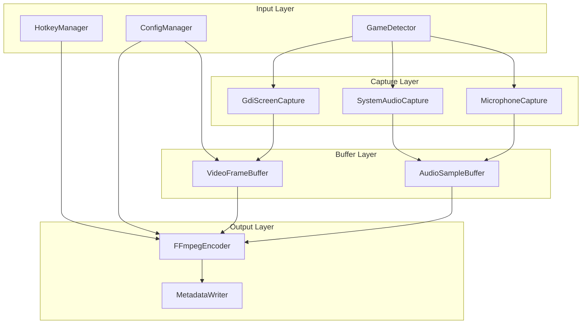

# ClipVault Core Engine - Phase 1

## Overview

A headless/minimal Windows service that continuously captures gameplay, maintains a rolling buffer, and saves clips on hotkey press. No database - all configuration and metadata stored in JSON files.

## Architecture



## Tech Stack

| Component      | Technology                                                   | Rationale                       |
| -------------- | ------------------------------------------------------------ | ------------------------------- |
| Screen Capture | GDI + Screen.CopyFromScreen (full screen, 720p)              | Simple, anti-cheat compatible   |
| Audio Capture  | NAudio 2.2+ with WASAPI                                      | WasapiLoopbackCapture + mic     |
| Encoding       | FFmpeg process with NVENC                                    | Simple, stable, process-based   |
| Global Hotkeys | Win32 RegisterHotKey                                         | Native Windows API              |
| Configuration  | System.Text.Json                                             | Built-in JSON handling          |

### Critical Technical Notes

**Screen Capture:**

- Current: GDI `Screen.CopyFromScreen` for full-screen capture (720p)
- Future: Windows.GraphicsCapture API for window-specific capture
- Anti-cheat compatible: GDI works; avoid injection/hooks

**NVENC Encoding:**

- Process-based FFmpeg (not FFmpeg.AutoGen)
- P7 preset, CQP 22 rate control, zero-latency settings
- Multi-track audio: system + mic as separate streams

**Audio:**

- Standardize both streams to **48kHz stereo float32**
- Memory for 5-minute buffer: ~110MB per audio stream
- **Copy buffers immediately** in DataAvailable handlers (they're reused!)

## Project Structure

```
ClipVault/
  ClipVault.sln
  Program.cs              # Entry point (WinExe)
  ClipVault.csproj        # Main project
  src/
    ClipVault.Core/              # Core library
      Capture/
        IScreenCapture.cs
        GdiScreenCapture.cs      # GDI-based full screen capture
      Audio/
        IAudioCapture.cs
        SystemAudioCapture.cs    # WASAPI loopback
        MicrophoneCapture.cs     # WASAPI capture
      Buffer/
        CircularBuffer.cs        # Generic circular buffer
        VideoFrameBuffer.cs      # Video ring buffer
        AudioSampleBuffer.cs     # PCM ring buffer
      Encoding/
        IEncoder.cs
        FFmpegEncoder.cs         # FFmpeg process with NVENC
        EncoderSettings.cs       # Quality presets
      Detection/
        GameDetector.cs          # Process monitoring + focus detection
        GameDatabase.cs          # Known games list from JSON
        FocusMonitor.cs          # GetForegroundWindow tracking
        IGameDetector.cs         # Interface
      Configuration/
        ConfigManager.cs         # Load/save settings.json
        ClipVaultConfig.cs       # Config schema
      Logging.cs
      NativeMethods.cs           # P/Invoke declarations
    ClipVault.Service/           # Library
      ClipVaultService.cs        # Main orchestrator
      HotkeyManager.cs           # Win32 RegisterHotKey
      ClipVault.Service.csproj

  config/
    settings.json                # User configuration
    games.json                   # Game detection database

  tools/ffmpeg/                  # FFmpeg binaries with NVENC
  docs/
    PLAN.md                      # This file
    CONVENTIONS.md               # Code style
```

## Key Implementation Details

### 1. Rolling Buffer Strategy

- **Video**: Keep last N seconds of frames in memory (byte arrays with timestamps)
- **Audio**: Keep last N seconds of float32 PCM samples in memory (~110MB for 5 min stereo)
- **Timestamps**: Each frame/sample tagged with high-resolution timestamp for A/V sync

**Frame timestamping pattern:**

```csharp
public record TimestampedFrame(
    nint TexturePointer,
    long TimestampTicks,  // QueryPerformanceCounter
    int Width,
    int Height
);
```

### 2. FFmpeg Encoding (NVENC)

Using process-based FFmpeg for simplicity:

```powershell
ffmpeg -y -f rawvideo -pix_fmt bgra -s:v 1280x720 -r 60 -i - `
  -f lavfi -i "anullsrc=r=48000:cl=stereo" `
  -c:v h264_nvenc -preset p7 -cq 22 -delay 0 -zerolatency 1 `
  -c:a aac -b:a 128k output.mp4
```

### 3. Configuration File (settings.json)

```json
{
    "bufferDurationSeconds": 60,
    "quality": {
        "resolution": "720p",
        "fps": 60,
        "nvencPreset": "p7",
        "cqLevel": 22
    },
    "hotkey": {
        "modifiers": ["Ctrl", "Alt"],
        "key": "F9"
    },
    "audio": {
        "captureSystemAudio": true,
        "captureMicrophone": true,
        "sampleRate": 48000
    },
    "outputDirectory": "D:\\Clips",
    "autoDetectGames": true
}
```

### 4. Game Detection

**Database:** `games.json` with 150+ game definitions

**Focus detection via Win32:**

```csharp
[DllImport("user32.dll")]
static extern IntPtr GetForegroundWindow();

[DllImport("user32.dll")]
static extern int GetWindowThreadProcessId(IntPtr hWnd, out int processId);

public bool IsGameFocused(int gameProcessId)
{
    var hwnd = GetForegroundWindow();
    GetWindowThreadProcessId(hwnd, out int focusedPid);
    return focusedPid == gameProcessId;
}
```

### 5. Anti-Cheat Compatibility (Riot Vanguard)

- **GDI capture works** - no injection/hooks, uses standard Windows APIs
- Window capture and Desktop Duplication work without issues
- Game capture hooks (like OBS "Game Capture") cause problems

## Dependencies (NuGet)

```xml
<!-- Audio capture -->
<PackageReference Include="NAudio" Version="2.2.1" />

<!-- Screen capture (GDI) -->
<PackageReference Include="System.Drawing.Common" Version="8.0.0" />
```

**Additional requirements:**

- FFmpeg binaries with NVENC support (in `tools/ffmpeg/`)
- .NET 8.0 SDK
- Windows 10+ (Build 18362+)
- NVIDIA GPU with NVENC (GTX 600+ series)

## Output Format

```
/Clips
  /LeagueofLegends_2026-01-28_14-32-15/
    clip.mp4              # Multi-track: video + system audio + mic
    metadata.json         # Game, duration, timestamps, audio track info
```

## Phase 2: Future Work (UI)

- Clip library browser
- Thumbnail grid view
- Non-destructive editor
- Timeline with trim handles
- Windows.Graphics.Capture API support (window-specific capture)
- DXGI Desktop Duplication fallback

## Implementation Checklist

- [x] Create solution structure with ClipVault.Core and ClipVault.Service projects
- [x] Implement ConfigManager with settings.json and games.json parsing
- [x] Implement GdiScreenCapture (GDI-based full screen capture)
- [x] Implement SystemAudioCapture (WASAPI loopback) and MicrophoneCapture
- [x] Implement VideoFrameBuffer and AudioSampleBuffer with configurable duration
- [x] Implement FFmpegEncoder with NVENC, outputs multi-track MP4
- [x] Implement GameDetector with process polling, games.json matching
- [x] Implement global hotkey registration using Win32 RegisterHotKey
- [x] Build ClipVaultService that ties all components together
- [x] Add minimal system tray icon with status indicator
- [x] Implement metadata.json generation
