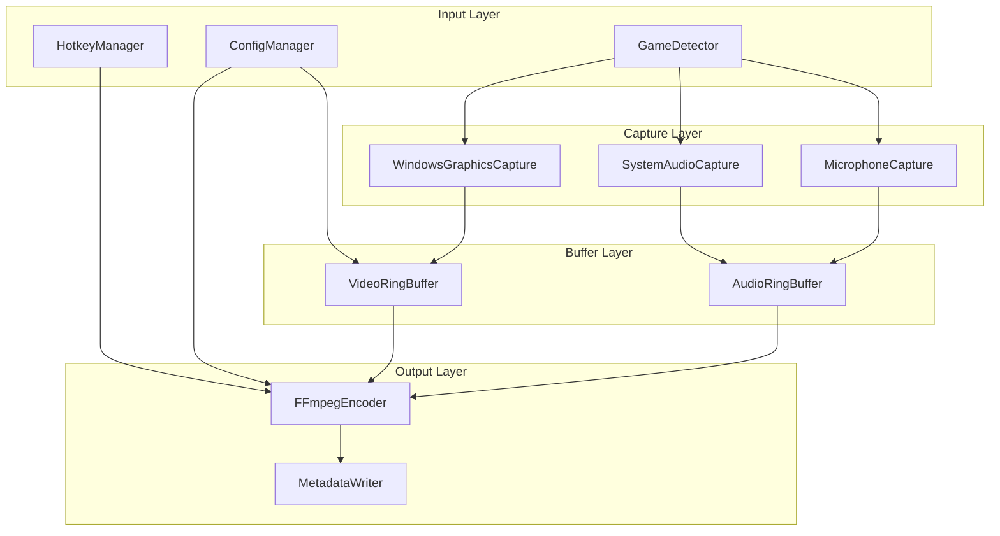

# ClipVault Core Engine - Phase 1

## Overview

A headless/minimal Windows service that continuously captures gameplay, maintains a rolling buffer, and saves clips on hotkey press. No database - all configuration and metadata stored in JSON files.

## Architecture



## Tech Stack (Validated)

| Component      | Technology                                                   | Rationale                                                                  |
| -------------- | ------------------------------------------------------------ | -------------------------------------------------------------------------- |
| Screen Capture | Windows.Graphics.Capture + DXGI Desktop Duplication fallback | WGC for window capture, DXGI DD as fallback for anti-cheat compatibility   |
| Audio Capture  | NAudio 2.2+ with WASAPI                                      | WasapiLoopbackCapture for system audio, WasapiCapture for mic              |
| Encoding       | FFmpeg.AutoGen + NVENC                                       | Direct API bindings for real-time frame streaming, avoids Process overhead |
| D3D11 Interop  | Vortice.Direct3D11/DXGI                                      | Modern successor to SharpDX, actively maintained                           |
| WinRT Interop  | Microsoft.Windows.CsWinRT v2.2.0                             | Required for Windows.Graphics.Capture API                                  |
| Global Hotkeys | Win32 RegisterHotKey                                         | Native Windows API                                                         |
| Configuration  | System.Text.Json                                             | Built-in, fast JSON handling                                               |

### Critical Technical Notes

**Screen Capture:**

- Use `Direct3D11CaptureFramePool.CreateFreeThreaded()` for 60fps capture
- Set `MinUpdateInterval` to at least 1ms (values < 1ms throttle to ~50fps)
- Borderless windowed mode is more reliable than fullscreen exclusive
- DXGI Desktop Duplication works as fallback when WGC has issues with anti-cheat

**NVENC Encoding:**

- Use **P7 preset** for highest quality (NVENC is dedicated hardware, no game impact)
- Use **CQP 22** rate control (not CBR) for recording quality
- Low-latency settings: `delay=0`, `zerolatency=1`, `gop_size=1`, `max_b_frames=0`
- Frames can stay in GPU memory with `AV_PIX_FMT_CUDA` pixel format

**Audio:**

- Standardize both streams to **48kHz stereo float32**
- Memory for 5-minute buffer: ~110MB per audio stream
- Copy buffers immediately in `DataAvailable` handlers (buffers are reused)

## Project Structure

```
ClipVault/
  ClipVault.sln
  src/
    ClipVault.Core/              # Core library
      Capture/
        IScreenCapture.cs
        WindowsGraphicsCapture.cs    # Primary: WinRT capture API
        DxgiDesktopDuplication.cs    # Fallback: for anti-cheat issues
        CaptureManager.cs            # Orchestrates capture with fallback
      Audio/
        IAudioCapture.cs
        SystemAudioCapture.cs        # WASAPI loopback (all system audio)
        MicrophoneCapture.cs         # WASAPI capture
        AudioCaptureManager.cs       # Coordinates both streams
      Buffer/
        CircularBuffer.cs            # Generic circular buffer
        VideoFrameBuffer.cs          # GPU texture ring buffer
        AudioSampleBuffer.cs         # PCM sample ring buffer
        TimestampedFrame.cs          # Frame with capture timestamp
      Encoding/
        IEncoder.cs
        FFmpegEncoder.cs             # FFmpeg.AutoGen with NVENC
        EncoderSettings.cs           # Quality presets
      Detection/
        GameDetector.cs              # Process monitoring + focus detection
        GameDatabase.cs              # Known games list from JSON
        FocusMonitor.cs              # GetForegroundWindow tracking
      Configuration/
        ClipVaultConfig.cs
        QualityPreset.cs
      ClipVault.Core.csproj

    ClipVault.Service/            # Background service with tray icon
      Program.cs
      ClipVaultService.cs         # Main orchestrator
      HotkeyManager.cs            # Win32 RegisterHotKey
      TrayIcon.cs                 # Minimal system tray
      NativeMethods.cs            # P/Invoke declarations
      ClipVault.Service.csproj

  config/
    settings.json                 # User configuration
    games.json                    # Known games database

  tools/
    ffmpeg.exe                    # Bundled FFmpeg binary (required)

  Clips/                          # Output directory (created at runtime)
```

## Key Implementation Details

### 1. Rolling Buffer Strategy

- **Video**: Keep last N seconds of D3D11 textures in GPU memory
- **Audio**: Keep last N seconds of float32 PCM samples in memory (~110MB for 5 min stereo)
- **Timestamps**: Each frame/sample tagged with high-resolution timestamp for A/V sync
- Buffer size: `duration * fps` frames for video, `duration * sampleRate * channels * 4` bytes for audio

**Frame timestamping pattern:**

```csharp
public record TimestampedFrame(
    ID3D11Texture2D Texture,
    long TimestampTicks,  // QueryPerformanceCounter
    int Width,
    int Height
);
```

### 2. FFmpeg.AutoGen Encoding (NVENC)

Using FFmpeg.AutoGen for direct API access (not Process piping):

```csharp
// NVENC encoder initialization
var codec = ffmpeg.avcodec_find_encoder_by_name("h264_nvenc");
var ctx = ffmpeg.avcodec_alloc_context3(codec);

ctx->width = 1920;
ctx->height = 1080;
ctx->time_base = new AVRational { num = 1, den = 60 };
ctx->pix_fmt = AVPixelFormat.AV_PIX_FMT_CUDA; // GPU memory

// Quality settings (P7 = highest quality, CQP 22 = good quality)
ffmpeg.av_opt_set(ctx->priv_data, "preset", "p7", 0);
ffmpeg.av_opt_set(ctx->priv_data, "rc", "cqp", 0);
ffmpeg.av_opt_set(ctx->priv_data, "cq", "22", 0);

// Low-latency for rolling buffer use case
ffmpeg.av_opt_set(ctx->priv_data, "delay", "0", 0);
ffmpeg.av_opt_set(ctx->priv_data, "zerolatency", "1", 0);
ctx->gop_size = 1;
ctx->max_b_frames = 0;
```

### 3. Configuration File (settings.json)

```json
{
    "bufferDurationSeconds": 60,
    "quality": {
        "resolution": "1080p",
        "fps": 60,
        "nvencPreset": "p7",
        "cqLevel": 22
    },
    "hotkey": {
        "modifiers": ["Ctrl", "Alt"],
        "key": "F9"
    },
    "audio": {
        "captureSystemAudio": true,
        "captureMicrophone": true,
        "sampleRate": 48000
    },
    "outputDirectory": "D:\\Clips",
    "autoDetectGames": true,
    "captureMethod": "auto"
}
```

### 4. Game Detection

**Data source:** [IGDB/Twitch Process List](https://github.com/qlaffont/igdb-twitch-process-list) + manual additions

We ship with a comprehensive `games.json` containing 150+ popular games. The format includes Twitch/IGDB IDs for potential future streaming integration.

**Focus detection via Win32:**

```csharp
[DllImport("user32.dll")]
static extern IntPtr GetForegroundWindow();

[DllImport("user32.dll")]
static extern int GetWindowThreadProcessId(IntPtr hWnd, out int processId);

// Check if a game window is focused
public bool IsGameFocused(int gameProcessId)
{
    var hwnd = GetForegroundWindow();
    GetWindowThreadProcessId(hwnd, out int focusedPid);
    return focusedPid == gameProcessId;
}
```

### 5. Anti-Cheat Compatibility (Riot Vanguard)

**Key findings:**

- Vanguard is kernel-mode and blocks game capture hooks
- OBS "Game Capture" causes FPS drops with Valorant
- **Window capture and Desktop Duplication work without issues**
- Medal.tv, ShadowPlay work fine (they use window/desktop capture)

**Our approach:**

1. Primary: Windows.Graphics.Capture (window capture mode)
2. Fallback: DXGI Desktop Duplication (if WGC fails or shows black)
3. No injection or hooking - uses only standard Windows APIs

**Capture method selection:**

```csharp
public IScreenCapture CreateCapture(CaptureMethod method, IntPtr hwnd)
{
    return method switch
    {
        CaptureMethod.Auto => TryWgcThenFallback(hwnd),
        CaptureMethod.WindowsGraphicsCapture => new WindowsGraphicsCapture(hwnd),
        CaptureMethod.DesktopDuplication => new DxgiDesktopDuplication(),
        _ => throw new ArgumentException()
    };
}
```

## Dependencies (NuGet)

```xml
<!-- Core WinRT interop for Windows.Graphics.Capture -->
<PackageReference Include="Microsoft.Windows.CsWinRT" Version="2.2.0" />

<!-- DirectX interop -->
<PackageReference Include="Vortice.Direct3D11" Version="3.6.0" />
<PackageReference Include="Vortice.DXGI" Version="3.6.0" />

<!-- Audio capture -->
<PackageReference Include="NAudio" Version="2.2.1" />

<!-- FFmpeg bindings (real-time encoding) -->
<PackageReference Include="FFmpeg.AutoGen" Version="7.0.0" />
```

**Additional requirements:**

- FFmpeg binaries with NVENC support (download from gyan.dev or build with `--enable-nvenc`)
- .NET 8.0 SDK
- Windows 10 Version 1903+ (Build 18362+)
- NVIDIA GPU with NVENC (GTX 600+ series)

## Output Format

```
/Clips
  /LeagueofLegends_2026-01-28_14-32-15/
    clip.mp4              # Multi-track: video + system audio + mic
    metadata.json         # Game, duration, timestamps, audio track info
    thumb.jpg             # Extracted at midpoint via FFmpeg
```

## Risks and Mitigations

| Risk                                                      | Likelihood | Mitigation                                          |
| --------------------------------------------------------- | ---------- | --------------------------------------------------- |
| Windows.Graphics.Capture shows black screen with Vanguard | Medium     | DXGI Desktop Duplication fallback implemented       |
| Audio/video sync drift over long recordings               | Low        | Use high-resolution timestamps, audio-driven sync   |
| High memory usage with 5-minute buffer                    | Low        | Configurable buffer duration, GPU memory for frames |
| FFmpeg.AutoGen complexity                                 | Medium     | Well-documented, fallback to Process if needed      |
| Game window handle changes during play                    | Low        | Periodic handle refresh, focus-based detection      |

## Alternative Approach: NvEncSharp

If FFmpeg.AutoGen proves too complex, consider **NvEncSharp** for direct NVENC access:

- NuGet: `Lennox.NvEncSharp`
- Simpler API, direct hardware access
- Zero-copy encoding from D3D11 textures
- Trade-off: Less flexible, NVIDIA-only (acceptable for this project)

## Phase 2 Considerations (for future UI)

The core is designed to be consumed by a future UI:

- `ClipVault.Core` exposes events for capture state, buffer status
- Metadata JSON is structured for library browsing
- Separate audio tracks in MP4 enable non-destructive editing (mute/unmute tracks)
- Thumbnail generation built-in for library view
- Clip metadata includes trim points for non-destructive editing

**UI Integration Points:**

```csharp
public interface IClipVaultService
{
    event EventHandler<CaptureStateChangedArgs> CaptureStateChanged;
    event EventHandler<ClipSavedArgs> ClipSaved;
    event EventHandler<GameDetectedArgs> GameDetected;

    bool IsCapturing { get; }
    TimeSpan BufferedDuration { get; }

    Task SaveClipAsync(TimeSpan duration);
    void StartCapture(IntPtr windowHandle);
    void StopCapture();
}
```

## Implementation Checklist

- [ ] Create solution structure with ClipVault.Core and ClipVault.Service projects, add NuGet dependencies
- [ ] Implement ConfigManager with settings.json and games.json parsing
- [ ] Implement WindowsGraphicsCapture using Windows.Graphics.Capture API with D3D11 texture output
- [ ] Implement SystemAudioCapture (WASAPI loopback) and MicrophoneCapture using NAudio
- [ ] Implement VideoFrameBuffer and AudioSampleBuffer with configurable duration
- [ ] Implement FFmpegEncoder that pipes buffered data to FFmpeg with NVENC, outputs multi-track MP4
- [ ] Implement GameDetector with process polling, games.json matching (150+ games pre-populated), and custom game support
- [ ] Implement global hotkey registration using Win32 RegisterHotKey
- [ ] Build ClipVaultService that ties all components together with lifecycle management
- [ ] Add minimal system tray icon with status indicator and exit option
- [ ] Implement metadata.json generation and thumbnail extraction via FFmpeg
